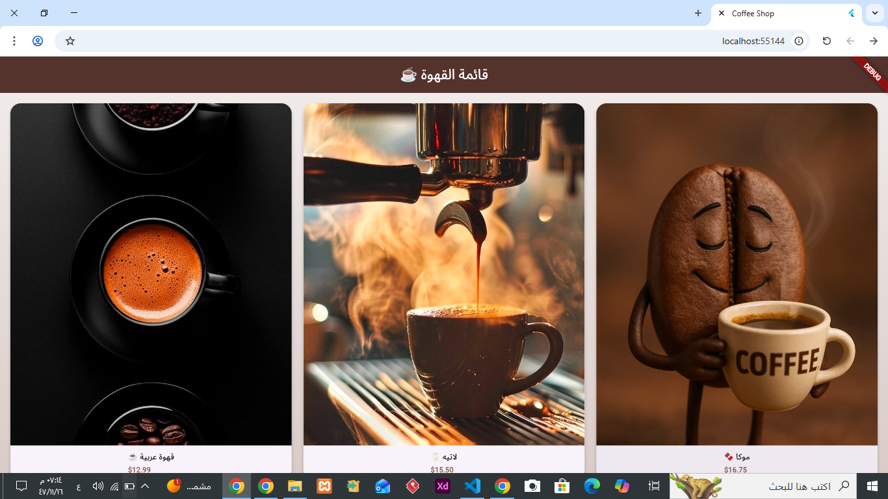
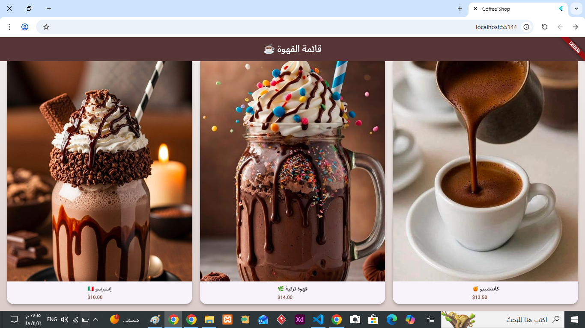
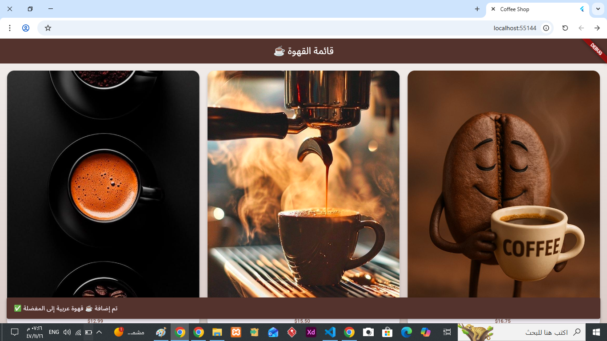

# ☕ Coffee Shop App - Passing Data

A Flutter application that demonstrates **passing and returning data between screens** using Navigator.

---

## 📸 Screenshots

### 🟢 Product List Screen


### 🟢 Coffee Details Screen


### 🟢 Return Message (SnackBar)


---

## ✨ Features

- Product List Screen
- Product Details Screen
- Passing data between screens
- Returning data using Navigator.pop
- Display result using SnackBar

---

## 🔄 Navigation Flow

1. Select coffee from list
2. Data is passed to details screen
3. Press button to return
4. Message is sent back
5. SnackBar shows the result

---

## 🛠️ Technologies Used

- Flutter
- Dart
- Navigator (push & pop)

---

## 🚀 How to Run

```bash
flutter pub get
flutter run
